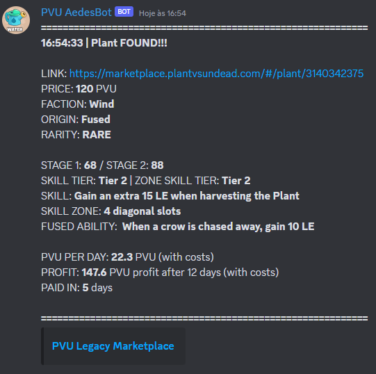

# Plant vs Undead Market Filter Discord Bot

This is a Discord bot that filters and reports on plants for sale in the Plant vs Undead (PVU) game's market. It analyzes the profitability of each plant based on predefined parameters.

## Prerequisites

Before you begin, ensure you have Python 3.7 or higher installed on your machine. Also, make sure pip (Python's package manager) is installed.

## Installation

Follow these steps to set up the bot:

1. **Clone the repository**
    ```
    git clone https://github.com/daanrod/pvu_mkt_filter_discord.git
    cd your-repository-name
    ```
2. **Set up a virtual environment**

    It's good practice to create a virtual environment to isolate the specific packages for this project. To do this, run the following commands:

    ```bash
    python3 -m venv .venv
    source .venv/bin/activate
    # Use ".venv\Scripts\activate" on Windows
    ```
    
3. **Install dependencies**

    After activating the virtual environment, install the necessary dependencies with the command:

    ```bash
    pip install -r requirements.txt
    ```

4. **Set up environment variables**

    Rename the `env-sample` file to `.env` and replace the values with your information:

    ```bash
    TOKEN = "YOUR_DISCORD_BOT_TOKEN"
    CHANNEL_ID_1 = "YOUR_CHANNEL_ID"
    CHANNEL_ID_2 = "YOUR_CHANNEL_ID"
    AUTH = "YOUR_PVU_AUTH_TOKEN"
    ```

    These values are necessary for the operation of the bot. Keep this file safe and do not share it as it contains sensitive information.

5. **Start the bot**

    With everything set up, now you can start the bot with the following command:

    ```bash
    python main.py
    ```

The bot should now be up and running! It will analyze the market and send reports to the specified Discord channels whenever it finds a plant that meets the profitability criteria.



## Contributing

Contributions are welcome! Feel free to open an issue or submit a pull request.
